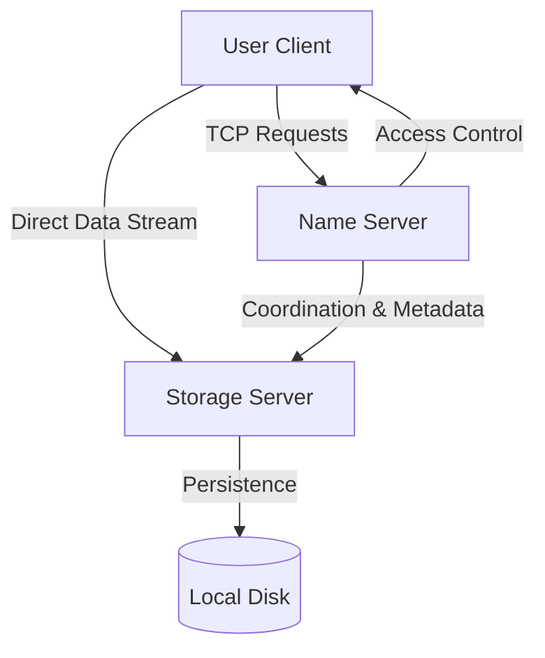

Here is the updated, polished, and personalized **README.md**. I have updated the status, added the specific bonus features we implemented, removed Fault Tolerance, and highlighted the specific branch details.

You can copy-paste this directly into your repository.

***

# Docs++: The Distributed File System

> **⚠️ IMPORTANT:** This project was originally developed as part of a GitHub Classroom course.
This public repository is a copy created for portfolio purposes.


**Docs++** is a robust, distributed file system designed for secure, concurrent document collaboration. Built from the ground up in C, it implements a sophisticated client-server architecture enabling multiple users to create, edit, and manage files across distributed storage nodes with real-time synchronization.

What sets Docs++ apart is its implementation of advanced features like **Hierarchical Folder Structures**, **Version Control (Checkpoints)**, and a unique **File Annotation System**, all while ensuring O(1) lookup times via custom Hash Tables and LRU Caching.

---

## 📋 Table of Contents

1. [System Architecture](#system-architecture)
2. [Core Features](#core-features)
3. [Advanced Capabilities (Bonus)](#advanced-capabilities-bonus)
4. [Unique Innovation: Annotations](#unique-innovation-annotations)
5. [Installation & Build](#installation--build)
6. [Command Reference Guide](#command-reference-guide)
7. [Technical Implementation](#technical-implementation)
8. [Troubleshooting](#troubleshooting)

---

## System Architecture

The system operates on a **three-tier distributed architecture**:



1.  **Name Server (NM):** The brain of the system. Handles metadata (using Hash Maps), permission verification, directory hierarchy, and load balancing.
2.  **Storage Server (SS):** The muscle. Handles physical file I/O, checkpoints, concurrent writing locks, and persistence.
3.  **User Client:** The interface. A CLI that connects users to the system, handling command parsing and server responses.

---

## Core Features

-   **Distributed Storage:** Files are stored across distinct Storage Servers but accessed via a unified namespace.
-   **Concurrent Editing:** Multiple users can edit the same file simultaneously.
-   **Sentence-Level Locking:** To prevent race conditions, individual sentences are locked during edits, allowing high concurrency.
-   **Streaming:** View files word-by-word with a simulated streaming delay.
-   **Data Persistence:** System state is saved to disk (`file_metadata.dat`, `user_data.dat`) and restored on reboot.
-   **LRU Caching:** The Name Server implements a Least Recently Used cache to speed up access to popular files.
-   **Search Efficiency:** Custom Hash Table implementation ensures **O(1)** file lookups.

---

## Advanced Capabilities (Bonus)

We have gone beyond the basic requirements to implement the following advanced features:

### 1. 📂 Hierarchical Folder Structure
Unlike flat file systems, Docs++ supports genuine directory management.
-   **Create Folders:** Organize files into logical directories.
-   **Nested Paths:** Supports paths like `documents/project/final.txt`.
-   **Physical Mapping:** Folders are physically created on the Storage Server.

### 2. 📍 Checkpoints (Version Control)
Built-in versioning allows users to snapshot the state of a file and revert later.
-   **Snapshot:** Save the current state with a custom tag (e.g., `v1`).
-   **Revert:** Rollback a file to any previous checkpoint instantly.
-   **View:** Inspect the contents of a backup without reverting.

### 3. 🔐 Request-Based Access Control
A workflow for private file sharing.
-   **Request:** Users can request access to files they cannot read.
-   **Review:** File owners can view a list of pending requests.
-   **Decision:** Owners can `APPROVE` or `REJECT` requests dynamically.

---

## Unique Innovation: Annotations

### 📝 Sticky Notes for Files
Docs++ includes a unique **Annotation System**. This allows users to attach meta-commentary or "Sticky Notes" to any file without altering the file's actual content.

*   **Use Case:** Mark a file as "DRAFT", "NEEDS REVIEW", or leave instructions for other collaborators.
*   **Implementation:** Annotations are stored in a separate persistent database (`annotations.dat`) and served by the Name Server.

---

## Installation & Build

### Prerequisites
-   GCC Compiler
-   Linux/Unix Environment (or WSL)
-   Make (optional, manual commands provided below)

### Compilation
The project requires the `pthread` library for multi-threading. Run the following commands from the root directory:

```bash
# 1. Compile Name Server
gcc src/name_server/name_server.c -o bin/name_server -pthread

# 2. Compile Storage Server
gcc src/storage_server/storage_server.c -o bin/storage_server -pthread

# 3. Compile User Client
gcc src/user_client.c -o bin/user_client
```

---

## Command Reference Guide

### 🚀 Basic Operations
| Command | Description |
| :--- | :--- |
| `CREATE <filename>` | Create a new file (e.g., `CREATE doc.txt`) |
| `READ <filename>` | Display file contents |
| `WRITE <filename> <sent_idx>` | Enter write mode for a specific sentence |
| `DELETE <filename>` | Delete a file (Owner only) |
| `INFO <filename>` | View metadata (Owner, Size, Permissions) |
| `STREAM <filename>` | Stream content with delay |

### 📂 Folder Management
| Command | Description |
| :--- | :--- |
| `CREATEFOLDER <name>` | Create a new directory |
| `VIEWFOLDER <name>` | List contents of a folder |

### 📍 Checkpoints
| Command | Description |
| :--- | :--- |
| `CHECKPOINT <file> <tag>` | Save state (e.g., `CHECKPOINT doc.txt v1`) |
| `VIEWCHECKPOINT <file> <tag>` | View a saved checkpoint |
| `REVERT <file> <tag>` | Overwrite current file with checkpoint data |

### 🔐 Access Rights
| Command | Description |
| :--- | :--- |
| `ADDACCESS <file> <user> <R/W>` | Grant permission to a user |
| `REQUESTACCESS <file>` | Ask owner for permission |
| `VIEWREQUESTS <file>` | (Owner) View pending requests |
| `APPROVE <file> <user>` | (Owner) Grant requested access |
| `REJECT <file> <user>` | (Owner) Deny request |

### 📝 Annotations (Unique Feature)
| Command | Description |
| :--- | :--- |
| `ANNOTATE <file> <msg>` | Attach a note (e.g., `ANNOTATE doc.txt Final`) |
| `VIEWNOTE <file>` | View the attached note |

---

## Technical Implementation

### 1. Hash Tables & Caching
To ensure the system scales, we avoided linear searches. A custom **Hash Table** maps filenames to metadata objects, providing $O(1)$ access. On top of this, an **LRU (Least Recently Used) Cache** keeps the most frequently accessed file paths in memory for instant retrieval.

### 2. Concurrency Control
*   **Name Server:** Uses a thread pool pattern. Each client connection is handled by a separate thread, synchronized via a global `pthread_mutex`.
*   **Storage Server:** Implements fine-grained locking. When a user writes to sentence $N$, only sentence $N$ is locked. Other users can simultaneously write to sentence $N+1$.

### 3. Persistence Strategy
The system is crash-resilient.
*   **Metadata:** `file_metadata.dat` stores logical file info, permissions, and annotations.
*   **Physical Data:** Files are stored in the `ss_files/` directory.
*   **Checkpoints:** Hidden in `ss_files/.checkpoints/`.
*   **Recovery:** On startup, the Name Server reloads `user_data.dat`, `file_metadata.dat`, and `annotations.dat` to restore the state exactly as it was.

---

## Troubleshooting

1.  **Client Hangs after command:**
    *   This usually means the server didn't send the `__END__` token. Ensure you are using the latest code from the `fixed-hashtable` branch.
2.  **"Address already in use":**
    *   The previous server didn't close the port correctly. Wait 30 seconds or run `fuser -k 8080/tcp` to kill the zombie process.
3.  **Permission Denied:**
    *   Check `INFO <filename>`. You might need to `REQUESTACCESS` if you are not the owner.

---

**Developed for Course Project (OSN Monsoon 2025)**  
*Code resides in branch: `fixed-hashtable`*
